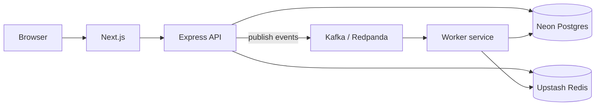

# Kafka guide for beginners (StockPredict)

## Your health check today

```json
{
  "ok": true,
  "redis": true,
  "redisMode": "upstash-rest"
}
```

**Redis** = fast cache (leaderboard, portfolio). Already working.

**Kafka** = event bus (message queue). Used for **async work** after trades and resolutions.

---

## Simple analogy

| Tool | Real-world analogy | In StockPredict |
|------|-------------------|-----------------|
| **Postgres (Neon)** | Filing cabinet — permanent records | Users, markets, orders |
| **Redis (Upstash)** | Sticky notes — fast, expires | Cached leaderboard & portfolio |
| **Kafka** | Post office — deliver messages later | Notify users, clear cache, logs |

When someone **trades**, the API saves to Postgres immediately, then drops a **message in Kafka**. A **worker** reads the message and sends notifications + clears Redis cache — without slowing the HTTP response.

---

## Do you need Kafka right now?

| Situation | Recommendation |
|-----------|----------------|
| Learning / demo / &lt; 100 users | **Optional** — `KAFKA_ENABLED=false` (default) |
| Heavy traffic, many trades/sec | **Yes** — enable Kafka + worker |
| Senior portfolio project | **Yes** — shows event-driven architecture |

The app works **without** Kafka. Side effects run inside the API (same as today).

---

## Architecture (senior pattern)



**Topics (channels):**

- `stockpredict.trades` — trades and orders
- `stockpredict.markets` — market resolved

**Event types:**

- `trade.executed` → notify users, invalidate cache
- `market.resolved` → payouts notifications, leaderboard cache
- `order.placed` → refresh user portfolio cache

---

## How to enable Kafka locally

### 1. Start Kafka (Docker)

```powershell
docker compose up -d
```

Uses **Redpanda** on `127.0.0.1:19092` (Kafka-compatible).

### 2. Add to `.env`

```env
KAFKA_ENABLED=true
KAFKA_BROKERS=127.0.0.1:19092
KAFKA_CLIENT_ID=stockpredict-api
KAFKA_GROUP_ID=stockpredict-worker
```

### 3. Run everything

```powershell
npm run dev
```

This starts:

- **API** (port 4000) — publishes events
- **Web** (port 3000)
- **Worker** — consumes events

### 4. Verify

http://localhost:4000/health

```json
{
  "kafkaEnabled": true,
  "kafka": true
}
```

Place a trade → worker terminal should log `[worker] trade.executed ...`

---

## Production options

- [Upstash Kafka](https://upstash.com/) — serverless, like your Redis
- [Confluent Cloud](https://confluent.cloud/)
- AWS MSK

Set `KAFKA_BROKERS` to the broker list from your provider.

---

## Files to know

| Path | Role |
|------|------|
| `packages/kafka/` | Kafka client, topics, publish |
| `apps/worker/` | Consumes events, cache + notifications |
| `apps/api/src/services/eventBus.js` | Kafka ON → publish; OFF → run inline |
| `docker-compose.yml` | Local Redpanda |

---

## FAQ

**Q: Redis vs Kafka?**  
Redis = cache. Kafka = async job queue. Use both.

**Q: Will it break without Kafka?**  
No. `KAFKA_ENABLED=false` keeps current behavior.

**Q: Why did TCP Redis fail but REST work?**  
Your network allows HTTPS (443) but may block Redis TCP (6379). Upstash REST avoids that.
