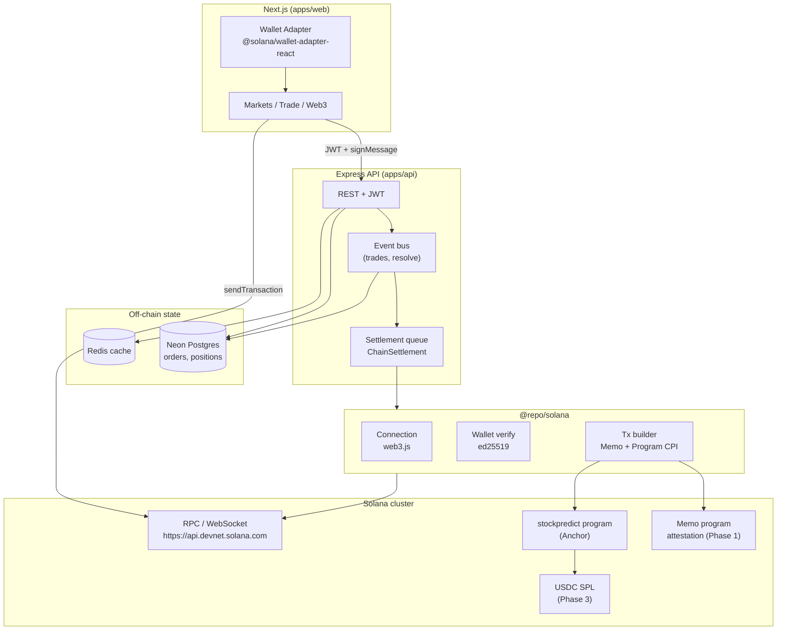
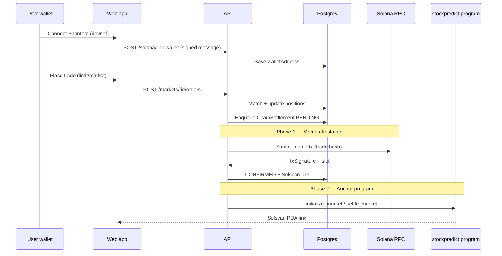

# Solana blockchain roadmap

This document maps how **StockPredict** evolves from play-money (Neon Postgres) to **on-chain settlement on Solana**, following [Solana official docs](https://solana.com/docs/intro/quick-start).

## Current vs target

| Layer | Today (Phase 0) | Target (Phase 4) |
|-------|-----------------|------------------|
| Matching | Express API + Prisma | Hybrid: off-chain book, on-chain escrow |
| Balances | `$10k` play money in Postgres | USDC/SOL in program vault PDAs |
| Auth | Email + JWT | JWT + linked Solana wallet (sign-in) |
| Settlement | DB transactions | Anchor program + oracle resolution |
| Notifications | Brevo + in-app | Same + on-chain tx links (Solscan) |

## Architecture diagram



## Settlement flow (automated)



## Phased rollout

### Phase 1 — Wallet + attestation ✅ (implemented)

**Goal:** Connect Solana wallets; prove trades on devnet without moving real money.

| Task | Reference |
|------|-----------|
| Wallet connect in Next.js | [Connect wallet React cookbook](https://solana.com/developers/cookbook/wallets/connect-wallet-react) |
| RPC + commitment | [Solana RPC docs](https://solana.com/docs/rpc) |
| Sign-in with wallet | ed25519 verify (`nacl` + `PublicKey`) |
| Trade attestation | [Memo program](https://spl.solana.com/memo) — anchor tx proof on-chain |

**Env:** `SOLANA_ENABLED=true`, `SOLANA_CLUSTER=devnet`, optional `SOLANA_SETTLEMENT_SECRET` (devnet keypair for memo txs).

**UI:** Nav wallet button + `/web3` dashboard.

---

### Phase 2 — Anchor program ✅ (implemented)

**Goal:** Deploy `stockpredict` program to devnet; register market PDAs from Admin.

| Feature | Details |
|---------|---------|
| Program | `onchain/programs/stockpredict` — `initialize_market`, `settle_market` |
| Client | `@repo/solana` + `@coral-xyz/anchor` + IDL |
| Admin API | `POST /admin/markets/:id/on-chain`, sync-all, on-chain settle |
| Auto | `SOLANA_AUTO_SETTLE` after off-chain resolve |
| UI | Admin Solana panel + Web3 market list |

Deploy: [onchain/README.md](../onchain/README.md)

```bash
cd onchain && anchor build && anchor deploy --provider.cluster devnet
# → SOLANA_PROGRAM_ID + SOLANA_SETTLEMENT_SECRET in .env
npm run db:push
```

---

### Phase 3 — Collateral (USDC devnet)

**Goal:** Replace play-money deposits with SPL USDC in vault.

| Task | Reference |
|------|-----------|
| USDC mint (devnet) | [SPL Token docs](https://spl.solana.com/token) |
| Associated token accounts | `getAssociatedTokenAddress` |
| Escrow on order | Lock USDC until match or cancel |

---

### Phase 4 — Full on-chain resolution

**Goal:** Oracle (admin/API) calls `resolve_market`; winners claim on-chain.

| Task | Reference |
|------|-----------|
| Pyth / admin oracle | Signed resolution instruction |
| Composability | Cross-program invocations ([Solana quick start](https://solana.com/docs/intro/quick-start)) |
| Mainnet | Private RPC ([cluster endpoints](https://solana.com/docs/rpc)) |

---

## Security checklist

- Never commit mainnet private keys; use devnet only for development.
- Verify every wallet link with `signMessage` + nonce (replay protection).
- Use `confirmed` or `finalized` commitment before marking settlements CONFIRMED.
- Rate-limit `/solana/*` routes; validate tx signatures server-side.
- Production: dedicated RPC (Helius, QuickNode), not public devnet endpoint.

## Repo layout (after Phase 1)

```
packages/solana/          # Shared SDK (connection, verify, tx build)
onchain/                  # Anchor program (Phase 2)
  programs/stockpredict/
apps/api/src/routes/solana.js
apps/web/src/components/SolanaProvider.jsx
apps/web/src/app/web3/page.js
```

## Quick start (Phase 1)

1. Add to `.env`:

```env
SOLANA_ENABLED=true
SOLANA_CLUSTER=devnet
SOLANA_RPC_URL=https://api.devnet.solana.com
NEXT_PUBLIC_SOLANA_CLUSTER=devnet
NEXT_PUBLIC_SOLANA_RPC_URL=https://api.devnet.solana.com
# Optional: devnet keypair (base58) to auto-submit memo attestations
SOLANA_SETTLEMENT_SECRET=
SOLANA_AUTO_ATTEST=true
```

2. `npm run db:push` (new wallet + settlement tables)

3. `npm run dev` → log in → connect wallet → **Web3** page → link wallet

4. Place a trade → check **Web3 → On-chain settlements** for memo tx on [Solscan devnet](https://solscan.io/?cluster=devnet)
